# AiO v26 Class Interaction Diagram

## Overview
This diagram shows the major class relationships in the AiO v26 firmware architecture.

```mermaid
graph TB
    %% Core System Classes
    subgraph "Core System"
        CM[ConfigManager<br/>Singleton]
        HM[HardwareManager<br/>Singleton]
        EL[EventLogger<br/>Singleton]
        CH[CommandHandler<br/>Singleton]
        POM[PinOwnershipManager<br/>Static]
        SRM[SharedResourceManager<br/>Static]
    end

    %% Communication Layer
    subgraph "Communication"
        QNB[QNetworkBase<br/>Static]
        AUH[QNEthernetUDPHandler<br/>Static]
        SM[SerialManager<br/>Singleton]
        CANM[CANManager<br/>Singleton]
        I2CM[I2CManager<br/>Singleton]
        SWM[SimpleWebManager<br/>Singleton]
        PP[PGNProcessor<br/>Static]
        TWS[TelemetryWebSocket<br/>Static]
    end

    %% Motor Driver Hierarchy
    subgraph "Motor Drivers"
        MDI{MotorDriverInterface<br/>Abstract}
        MDM[MotorDriverManager<br/>Singleton]
        PWM[PWMMotorDriver]
        KCD[KeyaCANDriver]
        DFM[DanfossMotorDriver]
        KSD[KeyaSerialDriver]
        
        MDM -->|creates| MDI
        PWM -.->|implements| MDI
        KCD -.->|implements| MDI
        DFM -.->|implements| MDI
        KSD -.->|implements| MDI
    end

    %% Navigation/Sensors
    subgraph "Navigation & Sensors"
        GNSS[GNSSProcessor<br/>Global]
        IMU[IMUProcessor<br/>Singleton]
        NAV[NAVProcessor<br/>Singleton]
        AD[ADProcessor<br/>Singleton]
        ENC[EncoderProcessor<br/>Singleton]
        PWMP[PWMProcessor<br/>Singleton]
        UBX[UBXParser]
        BNO[BNOAiOParser]
    end

    %% Control Systems
    subgraph "Control & Monitoring"
        AS[AutosteerProcessor<br/>Singleton]
        KM[KickoutMonitor<br/>Singleton]
        MP[MachineProcessor<br/>Singleton]
        WAF[WheelAngleFusion]
        LED[LEDManagerFSM<br/>Global]
    end

    %% System Services
    subgraph "System Services"
        RTCM[RTCMProcessor<br/>Static]
        OTA[SimpleOTAHandler<br/>Static]
        LDI[LittleDawnInterface<br/>Static]
    end

    %% Major Dependencies
    %% Config & Hardware
    CM -.->|config| AS
    CM -.->|config| KM
    CM -.->|config| AD
    CM -.->|config| ENC
    HM -->|pins| PWM
    HM -->|pins| DFM
    HM -->|pins| PWMP
    POM -->|validates| HM
    SRM -->|resources| I2CM
    SRM -->|resources| CANM

    %% Communication
    PP -->|routes PGNs| AS
    PP -->|routes PGNs| GNSS
    PP -->|routes PGNs| IMU
    PP -->|routes PGNs| NAV
    PP -->|routes PGNs| MP
    AUH -->|UDP packets| PP
    QNB -->|network| AUH
    CANM -->|CAN3| KCD
    I2CM -->|I2C| IMU
    I2CM -->|I2C| LED
    I2CM -->|I2C| MP
    TWS -->|telemetry| SWM
    SWM -->|events| EL

    %% Motor Control
    MDM -->|uses| HM
    MDM -->|uses| CANM
    AS -->|controls| MDI
    AS -->|monitors| KM
    KM -->|monitors| MDI
    KM -->|uses| AD
    KM -->|uses| ENC

    %% Sensor Fusion
    AS -->|uses| AD
    AS -->|uses| WAF
    WAF -->|fuses| AD
    WAF -->|fuses| ENC

    %% Logging
    EL -.->|logging| AS
    EL -.->|logging| MDM
    EL -.->|logging| GNSS
    EL -.->|logging| IMU

    %% Serial Communication
    SM -->|GPS serial| GNSS
    SM -->|RS232| RTCM
    RTCM -->|RTCM data| SM
    SM -->|IMU serial| IMU
    SM -->|Keya serial| KSD
    GNSS -->|uses| UBX
    IMU -->|uses| BNO

    %% Web Interface
    SWM -->|status| AS
    SWM -->|status| GNSS
    SWM -->|WebSocket| TWS
    SWM -->|config| CM
    SWM -->|OTA| OTA

    %% Command Processing
    CH -->|commands| MP
    CH -->|debug| AS
    CH -->|logging| EL
    
    %% Little Dawn Support
    LDI -->|processor info| HM
    LDI -->|processor info| CM
```



## Key Design Patterns

### 1. Singleton Pattern
Used extensively for system services that should have only one instance:
- **ConfigManager**: Central configuration storage
- **EventLogger**: Unified logging system
- **AutosteerProcessor**: Main control logic
- **MotorDriverManager**: Motor driver factory

### 2. Factory Pattern
- **MotorDriverManager** implements factory pattern to create appropriate motor driver based on detection/configuration

### 3. Abstract Interface Pattern
- **MotorDriverInterface** defines common interface for all motor drivers
- Allows AutosteerProcessor to work with any motor driver implementation

### 4. Observer/Callback Pattern
- **PGNProcessor** implements message routing via callbacks
- Classes register callbacks for specific PGN messages
- Decouples message producers from consumers

### 5. Dependency Injection
- Motor drivers receive HardwareManager reference
- Allows testing with mock hardware managers

### 6. Resource Management Pattern
- PinOwnershipManager tracks pin usage
- SharedResourceManager manages shared hardware
- Prevents conflicts at compile and runtime

## Communication Flow

### PGN Message Flow:
```
AgOpenGPS → UDP → AsyncUDPHandler → PGNProcessor → Registered Handlers
```

### Motor Control Flow:
```
AutosteerProcessor → MotorDriverInterface → Concrete Driver → Hardware
```

### Sensor Data Flow:
```
Hardware → ADProcessor/EncoderProcessor → WheelAngleFusion → AutosteerProcessor
```

### Web/Telemetry Flow:
```
Processors → EventLogger → TelemetryWebSocket → SimpleWebManager → Browser
```

## Key Relationships

### Has-A (Composition)
- MotorDriverManager **has** MotorDriverInterface instances
- AutosteerProcessor **has** references to sensors and motor driver
- WebManager **has** AsyncWebServer instance

### Uses (Dependencies)
- Most classes **use** EventLogger for logging
- Most classes **use** ConfigManager for settings
- Motor drivers **use** HardwareManager for pin control

### Implements (Interface)
- PWMMotorDriver **implements** MotorDriverInterface
- KeyaCANDriver **implements** MotorDriverInterface
- DanfossMotorDriver **implements** MotorDriverInterface

## Thread Safety
- Most singletons use getInstance() pattern
- Critical sections protected by interrupt disabling
- SharedResourceManager provides thread-safe hardware access
- I2CManager includes mutex protection for bus access

## Module Initialization Order

1. **Hardware Layer**: HardwareManager, PinOwnershipManager
2. **Communication**: I2CManager, CANManager, SerialManager
3. **Network**: QNetworkBase, QNEthernetUDPHandler
4. **Core Services**: ConfigManager, EventLogger, PGNProcessor
5. **Sensors**: ADProcessor, EncoderProcessor, GNSSProcessor, IMUProcessor
6. **Control**: MotorDriverManager, AutosteerProcessor, MachineProcessor
7. **Web Services**: SimpleWebManager, TelemetryWebSocket
8. **User Interface**: LEDManagerFSM, CommandHandler

## PGN Message Registration

### Direct Registration (specific PGNs):
- AutosteerProcessor: PGN 254 (steer command)
- MachineProcessor: PGN 239 (section control)
- GNSSProcessor: PGN 211 (GPS config)
- IMUProcessor: PGN 192 (IMU config)
- NAVProcessor: PGN 197 (navigation config)

### Broadcast Registration (all PGNs):
- EventLogger: For logging purposes
- WebSocket: For telemetry streaming

### Special PGNs:
- PGN 200: Module scan request (handled internally)
- PGN 202: Module hello broadcast (never register)
- PGN 201: Subnet response (automatic)